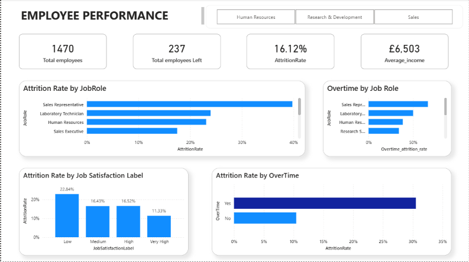
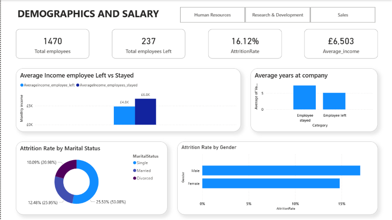

# 📍HR Attrition Dashboard 
## 📌Project Overview
An interactive 3 page HR analytics dashboard built to analyse employee attrition patterns across 1,470 employees using the IBM HR Analytics dataset. The project explores key drivers of attrition including salary, overtime, job satisfaction, demographics and department performance.

## 🔨Tools I used for this project
* Excel
* Power Query
* Power BI
* DAX
* Figma

  
## 📌Key Features
### Overview Page
  * **KPI Cards** - Total Employees (1470), Total Employees Left (237), Attrition Rate (16.12%), Average Income(£ 6503)
  * **Sales Department** has highest attrition rate(20.63%) than other departments.
  * Employees who are **below 30** have highest attrition rate at **26%**
  * **Frequent business travellers** leaves significantly more than non travellers.

### Employee Performance
  * **Sales Representative (39.76%) and Laboratory Technician (23.94%)** who works overtime have the highest attrition rate
  * **80% of managers** who left were working overtime.
  * Employees with **lower Job satisfaction level** have higher attrition rate at **22.84%**
  * Overtime workers have **30.53% attrition** over non-overtime workers

### Demographics and salary
  * Employees who left had **lower salary (£ 4787)** comparing to stayers with a **£2,046 gap**
  * Employees who're **single leave most at 25.53%** than married and divorced employees.
  * Average tenure before leaving is **5.1 years**
  * **Male employees** show slightly higher attrition than female employees.

    
## 📂Dashboard Preview

## 📂 Data Source
IBM HR Analytics Employee Attrition & Performance Dataset 
[View Dataset](https://www.kaggle.com/datasets/pavansubhasht/ibm-hr-analytics-attrition-dataset)

## 💡What I learned
  * Writing DAX measures for custom KPIs and attrition calculations
  * Using Power Query for data transformation and conditional columns
  * Translating complex HR data into clear business narratives
  * Designing a Z-pattern dashboard layout for clear visual storytelling
  * Building an interactive slicers and cross-filtering visuals in Power BI
  * Using a sort column in power query for Age group ordering

### 🔗connect with me on [Linkedin](https://www.linkedin.com/in/gayathri-raja-187883352/)
