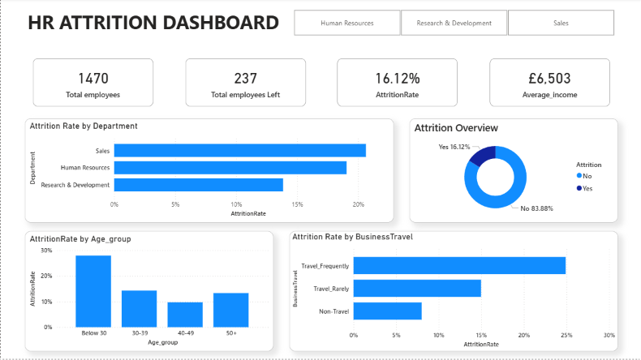

# 📍HR Attrition Dashboard 
## 📌Project Overview
I have built this HR dashboard using power BI and EXCEL to analyse the attrition rate, employee performance, demographics and salary of employees.

## 🔨Tools i used for this project
* Excel
* Power Query
* Power BI
* DAX

  
## 📌Key Features
### Overview Page
  * **KPI Cards** - Total Employees (1470), Total Employees Left (237), Attrtion Rate (16.12%), Average Income(£ 6503)
  * **Sales Department** has more attrition rate than other departments.
  * Employees who are **below 30** have highest attrition rate.
  * **Business travellers** leaves more than non travellers.

### Employee Performance
  * **Sales Representative (39.76%) and Laboratory Technician (23.94%)** who works overtime has highest overall attrition rate
  * Employees with lower Job satisfaction level has higher attrition rate(22.84%)

### Demographics and salary
  * Employees who left had **lower salary bandwidth(£ 4787)** comparing employees who stayed
  * Employees who're **single left more** than married and divorced employees.
  * Average years for employees before leaving is **5 years**
  * Genderwise Men left more than female employees.

    
## Dashboard Preview

